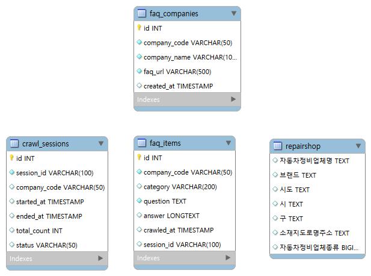

# 1.🚗 자동차 등록 & 기업 FAQ 대시보드

Streamlit 기반 데이터 조회 GUI 애플리케이션
[웹페이지 최종 NAME 뭐가 더 나은가요..?]
# 2.🚗 자동차 데이터 통합 대시보드

자동차 등록 현황, 기업 FAQ, 정비소 정보를 통합 조회 및 분석할 수 있는 Streamlit 기반 데이터 조회 GUI 애플리케이션

---
## 👨‍💻 팀 소개 :  MULTITASKING

|  |  |  |  |
|:---:|:---:|:---:|:---:|
| 김남균 | 서유현 | 송채영 | 임정택 |
| role | role | role | role |
| [GitHub](https://github.com/hyg10) | [GitHub](https://github.com/cls15rn) | [GitHub](https://github.com/changlike) | [GitHub](https://github.com/wjdxor0405) |

## ⚒️ Tech Stack

### Language & Framework


### Data Processing


### Crawling


### Database


### Visualization


### Tools


## 📌 프로젝트 소개

공공데이터와 기업 FAQ 데이터를 통합하여 자동차 등록 현황, 기업 FAQ, 정비소 정보를 조회할 수 있는 Streamlit 기반 데이터 대시보드입니다.

사용자는 지역 기반 필터링과 데이터 시각화를 통해 자동차 관련 정보를 직관적으로 탐색할 수 있습니다.

## 🧩 개발 배경

- 자동차 관련 데이터는 공공데이터 포털, 기업 홈페이지, 정비소 정보 등 여러 플랫폼에 분산되어 있어 통합 조회와 비교 분석에 존재하는 어려움
- 사용자는 원하는 정보를 얻기 위해 여러 사이트를 각각 방문해야 했으며, 데이터 형식 또한 통일되어 있지 않아 효율적인 탐색과 활용에 겪는 불편함
- 이러한 문제를 해결하기 위해 자동차 관련 데이터를 하나의 환경에서 통합 조회할 수 있는 시스템의 필요성을 느낌 

본 프로젝트는 이를 해결하기 위해

- 공공데이터 기반 자동차 등록 현황 자동 파싱
- 기업 FAQ 크롤링 자동 수집 및 관리
- 지역 기반 정비소 검색 시스템
- 데이터 시각화 대시보드 제공

이를 하나의 Streamlit 기반 GUI로 통합하여  
사용자 편의성과 데이터 접근성을 높이고자 개발했습니다.

## 🎯 프로젝트 목표

- 자동차 관련 데이터를 하나의 서비스로 통합
- 비개발자도 쉽게 사용할 수 있는 GUI 제공
- 크롤링 데이터 자동 수집 및 저장
- 지역 기반 검색 및 시각화 기능 구현

## 🔎 주요 기능

### 1. 전국 자동차 등록 현황
- KOSIS 자동차등록대수현황 xlsx 자동 파싱
- 시도별 / 차종별 / 용도별 필터링
- 막대 차트, 파이 차트, 스택 차트
- 시군구 상세 조회

### 2. 기업 FAQ 조회
- Selenium + BeautifulSoup 기반 크롤링
- MySQL 누적 저장 및 조회
- 크롤링 세션별 결과 vs 전체 누적 데이터 구분

### 3. 현대 / 기아 정비소 조회
- 전국자동차정비업체표준데이터 csv 파일 자동 적재
- 현대자동차(블루핸즈) / 기아자동차(오토큐)필터링
- 도 -> 시/군 -> 구 지역 계층별 조회
- 검색어 기반 사용자 지정 서칭 가능  

## ⚙️ 설치 및 실행
### 0. 가상환경 구성
```bash
python -m venv .venv
```

### 1. 패키지 설치
```bash
pip install -r requirements.txt
```

### 2. MySQL 설정 (FAQ 누적 저장 시 필요)
`.env`파일을 추가하여 다음 내용을 입력:
```python
# MySQL DB connection settings
MYSQL_HOST=localhost
MYSQL_PORT=3306
MYSQL_USER=student
MYSQL_PASSWORD=<패스워드>
MYSQL_DATABASE=car_dashboard
MYSQL_CHARSET=utf8mb4
```

### 3. webdriver-manager 설치 (크롤링 시 필요)
```bash
pip install webdriver-manager
```

### 4. 앱 실행
```bash
cd proto_proj1
streamlit run app.py
```

---

## 📁 프로젝트 구조

```
proto_proj1/
├── app.py                  # 메인 진입점
├── requirements.txt
├── data/                   # xlsx 파일 폴더 (자동 인식)
│   └── 자동차등록대수현황_시도별_*.xlsx
├── pages/
│   ├── car_page.py         # 자동차 등록 현황 페이지
│   └── faq_page.py         # FAQ 조회 페이지
│   └── repairshop_page.py  # 정비소 페이지
├── utils/
│   ├── car_data.py           # xlsx 파싱 유틸
│   └── database.py           # FAQ데이터 MySQL 연동
│   └── repairshop_service.py # 정비소 데이터 MySQL 연동
├── crawlers/
│   └── faq_crawler.py
│   └── hyundai_faq_crawler.py  # 현대자동차 FAQ 크롤러
│   └── kia_faq_crawler.py      # 기아자동차 FAQ 크롤러
├── sql/
│   └── repairshop.sql        # 정비소 데이터 SQL문
│   └── schema.sql            #  FAQ 데이터 SQL문(현대 + 기아.)
├── model/
│   └── faq_model.py          # 크롤링된 데이터를 utils/database.py에서 설정된 스키마로 저장
│   └── 
```
---
## 📊 Entity Relationship Diagram


## 💬 프로젝트 회고

| 이름 | 회고 |
|---|---|
| 김남균 | |
| 서유현 |  |
| 송채영 |  |
| 임정택 |  |
